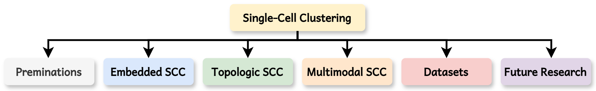

# Awesome Single-Cell Clustering

[](https://awesome.re)
[](https://github.com/DayuHuu/Awesome-Single-Cell-Clustering/stargazers)
[](https://github.com/DayuHuu/Awesome-Single-Cell-Clustering/network/members)
[](https://github.com/DayuHuu/Awesome-Single-Cell-Clustering/graphs/commit-activity)

**Awesome Single-Cell Clustering** is a curated repository dedicated to tracking the latest advancements in single-cell clustering methodologies. This collection encompasses state-of-the-art papers, source codes, and benchmark datasets, categorized by their underlying algorithmic strategies

<div align="center">
    
</div>

---

## 🚩 Table of Contents

- [Embedded Single-Cell Deep Clustering](#embedded-single-cell-deep-clustering)
- [Topological Single-Cell Deep Clustering](#topological-single-cell-deep-clustering)
- [Multi-Modal Single-Cell Deep Clustering](#multi-modal-single-cell-deep-clustering)
- [Contribution & Contact](#contribution--contact)

---

## Embedded Single-Cell Deep Clustering

| Year | Title | Venue | Resources  |
| :---: | :--- | :---: | :---: |
| 2024 | **Dimension reduction, cell clustering, and cell–cell communication inference for single-cell transcriptomics with DcjComm** | GB | [📄 Paper](https://genomebiology.biomedcentral.com/articles/10.1186/s13059-024-03385-6) • [💻 Code](https://github.com/Ginnay/DcjComm) |
| 2024 | **[G3DC] G3DC: A Gene-Graph-Guided Selective Deep Clustering Method for Single Cell RNA-seq Data** | BDMA | [📄 Paper](https://ieeexplore.ieee.org/document/10654682/) • [💻 Code](https://github.com/Ketherine0/G3DC) |
| 2024 | **[scASDC] scASDC: Attention Enhanced Structural Deep Clustering for Single-cell RNA-seq Data** | Arxiv | [📄 Paper](http://arxiv.org/abs/2408.05258) • [💻 Code](https://github.com/wenwenmin/scASDC) |
| 2024 | **[DP-DCAN] DP-DCAN: Differentially Private Deep Contrastive Autoencoder Network for Single-cell Clustering** | ICIC | [📄 Paper](http://arxiv.org/abs/2311.03410) |
| 2024 | **[scMNMF] scMNMF: a novel method for single-cell multi-omics clustering based on matrix factorization** | BIB | [📄 Paper](https://academic.oup.com/bib/article/doi/10.1093/bib/bbae228/7675151) • [💻 Code](https://github.com/yushanqiu/scMNMF) |
| 2023 | **A critical assessment of clustering algorithms to improve cell clustering and identification in single-cell transcriptome study** | BIB | [📄 Paper](https://academic.oup.com/bib/article/doi/10.1093/bib/bbad497/7505072) |
| 2023 | **Attention-based deep clustering method for scRNA-seq cell type identification** | PCB | [📄 Paper](https://dx.plos.org/10.1371/journal.pcbi.1011641) • [💻 Code](https://github.com/LiShenghao813/AttentionAE-sc) |
| 2023 | **Self-supervised deep clustering of single-cell RNA-seq data to hierarchically detect rare cell populations** | BIB | [📄 Paper](https://academic.oup.com/bib/article/doi/10.1093/bib/bbad335/7283019) • [💻 Code](https://github.com/shaoqiangzhang/DeepScena) |
| 2023 | **[DISCERN] DISCERN: deep single-cell expression reconstruction for improved cell clustering and cell subtype and state detection** | GB | [📄 Paper](https://genomebiology.biomedcentral.com/articles/10.1186/s13059-023-03049-x) • [💻 Code](https://github.com/vtraag/leidenalg) |
| 2023 | **Deep enhanced constraint clustering based on contrastive learning for scRNA-seq data** | BIB | [📄 Paper](https://academic.oup.com/bib/article/doi/10.1093/bib/bbad222/7197084) • [💻 Code](https://github.com/DBLABDHU/scDECL.) |
| 2023 | **[scDCCA] scDCCA: deep contrastive clustering for single-cell RNA-seq data based on auto-encoder network** | BIB | [📄 Paper](https://academic.oup.com/bib/article/doi/10.1093/bib/bbac625/6984787) • [💻 Code](https://github.com/WJ319/scDCCA) |
| 2022 | **[ADClust] ADClust: A parameter-free deep embedded clustering method for single-cell RNA-seq data** | BIB | [📄 Paper](https://academic.oup.com/bib/article/23/5/bbac172/6582003?login=false) • [💻 Code](https://github.com/biomed-AI/ADClust) |
| 2022 | **[scDSSC] scDSSC: Deep Sparse Subspace Clustering for scRNA-seq Data** | PCB | [📄 Paper](https://dx.plos.org/10.1371/journal.pcbi.1010772) • [💻 Code](https://github.com/WHY-17/scDSSC.) |
| 2022 | **[NISC] NISC: Neural Network-Imputation for Single-Cell RNA Sequencing and Cell Type Clustering** | Frontiers | [📄 Paper](https://www.frontiersin.org/articles/10.3389/fgene.2022.847112/full) |
| 2022 | **Deep clustering of small molecules at large-scale via variational autoencoder embedding and K-means** | BMC Bio | [📄 Paper](https://bmcbioinformatics.biomedcentral.com/articles/10.1186/s12859-022-04667-1) • [💻 Code](https://github.com/HamidHadipour/Deep-clustering-of-small-molecules-at-large-scale-via-variational-autoencoder-embedding-and-K-means.) |
| 2022 | **Comparison of deep learning-based pre-processing and clustering approaches for single-cell RNA sequencing data** | BIB | [📄 Paper](https://academic.oup.com/bib/article/doi/10.1093/bib/bbab345/6361043) • [💻 Code](https://github.com/calico/solo) |
| 2022 | **[ScCAEs] ScCAEs: deep clustering of single-cell RNA-seq via convolutional autoencoder embedding and soft K-means** | BIB | [📄 Paper](https://academic.oup.com/bib/article/doi/10.1093/bib/bbab321/6362111) • [💻 Code](https://github.com/gushenweiz/scCAEs.) |
| 2021 | **Contrastive self-supervised clustering of scRNA-seq data** | BMC Bio | [📄 Paper](https://bmcbioinformatics.biomedcentral.com/articles/10.1186/s12859-021-04210-8) |
| 2021 | **Clustering single cell CITE-seq data with a canonical correlation based deep learning method** | Biorxiv | [📄 Paper](http://biorxiv.org/lookup/doi/10.1101/2021.09.07.459236) |
| 2021 | **Deep learning-based clustering approaches for bioinformatics** | BIB | [📄 Paper](https://academic.oup.com/bib/article/22/1/393/5721075) • [💻 Code](https://github.com/rezacsedu/Deep-learningfor-clustering-in-bioinformatics.) |
| 2020 | **[scAIDE] scAIDE: clustering of large-scale single-cell RNA-seq data reveals putative and rare cell types** | NAR | [📄 Paper](https://academic.oup.com/nargab/article/doi/10.1093/nargab/lqaa082/5920393) • [💻 Code](https://github.com/tinglabs/scAIDE.) |
| 2020 | **[scVAE] scVAE: variational auto-encoders for single-cell gene expression data** | BIB | [📄 Paper](https://academic.oup.com/bioinformatics/article/36/16/4415/5838187) • [💻 Code](https://github.com/scvae/scvae.) |
| 2020 | **Robust unsupervised dimensionality reduction based on feature clustering for single-cell imaging data** | ASCJ | [📄 Paper](https://linkinghub.elsevier.com/retrieve/pii/S1568494620303616) • [💻 Code](https://github.com/dperaltac/scalable-statistics.) |
| 2020 | **Deep learning enables accurate clustering with batch effect removal in single-cell RNA-seq analysis** | NC | [📄 Paper](https://www.nature.com/articles/s41467-020-15851-3) • [💻 Code](https://github.com/theislab/scanpy) |
| 2020 | **Single-Cell Transcriptome Data Clustering via Multinomial Modeling and Adaptive Fuzzy K-Means Algorithm** | Frontiers | [📄 Paper](https://www.frontiersin.org/article/10.3389/fgene.2020.00295/full) • [💻 Code](https://github.com/xuebaliang/scDMFK.) |
| 2020 | **Dimension Reduction and Clustering Models for Single-Cell RNA Sequencing Data: A Comparative Study** | IJMS | [📄 Paper](https://www.mdpi.com/1422-0067/21/6/2181) |
| 2020 | **Pathway-based deep clustering for molecular subtyping of cancer** | Methods | [📄 Paper](https://linkinghub.elsevier.com/retrieve/pii/S1046202319300489) • [💻 Code](https://github.com/tmallava/PACL) |
| 2020 | **[DSCD] DSCD: A Novel Deep Subspace Clustering Denoise Network for Single-Cell Clustering** | IEEE Access | [📄 Paper](https://ieeexplore.ieee.org/document/9115662/) |
| 2019 | **Impact of similarity metrics on single-cell RNA-seq data clustering** | BIB | [📄 Paper](https://academic.oup.com/bib/article/20/6/2316/5077112) • [💻 Code](https://github.com/taiyunkim/scClustBench) |
| 2019 | **Combining gene ontology with deep neural networks to enhance the clustering of single cell RNA-Seq data** | BMC Bio | [📄 Paper](https://bmcbioinformatics.biomedcentral.com/articles/10.1186/s12859-019-2769-6) |
| 2018 | **Clustering single cells: a review of approaches on high-and low-depth single-cell RNA-seq data** | BFG | [📄 Paper](https://academic.oup.com/bfg/article/17/4/240/4728639) |
| 2016 | **Single-Channel Multi-Speaker Separation using Deep Clustering** | Arxiv | [📄 Paper](http://arxiv.org/abs/1607.02173) |

[⬆ Back to Top](#-table-of-contents)

---

## Topological Single-Cell Deep Clustering

| Year | Title | Venue | Resources |
| :---: | :--- | :---: | :---: |
| 2024 | **[scDFN] scDFN: enhancing single-cell RNA-seq clustering with deep fusion networks** | BIB | [📄 Paper](https://academic.oup.com/bib/article/doi/10.1093/bib/bbae486/7811489) • [💻 Code](https://github.com/11051911/scDFN.) |
| 2024 | **[scGeom] scGeom: Topological and geometric analysis of cell states in single-cell transcriptomic data** | BIB | [📄 Paper](https://academic.oup.com/bib/article/doi/10.1093/bib/bbae176/7648264) • [💻 Code](https://github.com/zcang/scGeom) |
| 2024 | **Local-Global Graph Fusion to Enhance scRNA-Seq Clustering** | IEEE Access | [📄 Paper](https://ieeexplore.ieee.org/document/10737050/) |
| 2024 | **[DCRELM] DCRELM: dual correlation reduction network-based extreme learning machine for single-cell RNA-seq data clustering** | Nature | [📄 Paper](https://www.nature.com/articles/s41598-024-64217-y) • [💻 Code](https://github.com/gaoqingyun‐lucky/awesome‐DCRELM.) |
| 2024 | **Global-Constrained Concept Factorization and a Regularized Gaussian Graphical Model for Clustering Single-Cell RNA-seq Data** | RG | [📄 Paper](https://link.springer.com/10.1007/s12539-023-00587-7) • [💻 Code](https://github.com/Yaxin-Xu/GCFG) |
| 2024 | **Comparative analysis of cell–cell communication at single-cell resolution** | NB | [📄 Paper](https://www.nature.com/articles/s41587-023-01782-z) • [💻 Code](https://www.10xgenomics.com/resources/datasets) |
| 2024 | **Label-aware distance mitigates temporal and spatial variability for clustering and visualization of single-cell gene expression data** | CB | [📄 Paper](https://www.nature.com/articles/s42003-024-05988-y) • [💻 Code](https://github.com/KChen-lab/lad) |
| 2024 | **Robust_scRNA-seq_Cell_Types_Identification_by_Self-Guided_Deep_Clustering_Network** | IEEE Access | [📄 Paper](https://ieeexplore.ieee.org/document/10508797/) • [💻 Code](https://github.com/wangyisong66/experiment.git.) |
| 2024 | **Cauchy hyper-graph Laplacian nonnegative matrix factorization for single-cell RNA-sequencing data analysis** | BMC Bio | [📄 Paper](https://bmcbioinformatics.biomedcentral.com/articles/10.1186/s12859-024-05797-4) |
| 2024 | **[DANCE] DANCE: a deep learning library and benchmark platform for single-cell analysis** | GB | [📄 Paper](https://genomebiology.biomedcentral.com/articles/10.1186/s13059-024-03211-z) • [💻 Code](https://github.com/OmicsML/dance) |
| 2023 | **Toward Convex Manifolds: A Geometric Perspective for Deep Graph Clustering of Single-cell RNA-seq Data** | IJCAI | [📄 Paper](https://www.ijcai.org/proceedings/2023/540) • [💻 Code](https://github.com/MMAMAR/scTConvexMan) |
| 2023 | **[scGPCL] scGPCL: Deep single-cell RNA-seq data clustering with graph prototypical contrastive learning** | BIB | [📄 Paper](https://academic.oup.com/bioinformatics/article/doi/10.1093/bioinformatics/btad342/7180270) • [💻 Code](https://github.com/Junseok0207/scGPCL) |
| 2023 | **[CPSmerge] CPSmerge: Multi-view clustering by CPS-merge analysis with application to multimodal single-cell data** | PCB | [📄 Paper](https://dx.plos.org/10.1371/journal.pcbi.1011044) |
| 2023 | **Review of single-cell RNA-seq data clustering for cell-type identification and characterization** | PCB | [📄 Paper](https://dx.plos.org/10.1371/journal.pcbi.1011044) |
| 2023 | **Topological identification and interpretation for single-cell gene regulation elucidation across multiple platforms using scMGCA** | NC | [📄 Paper](https://www.nature.com/articles/s41467-023-36134-7) • [💻 Code](https://github.com/theislab/dca) |
| 2023 | **[JOINTLY] JOINTLY: interpretable joint clustering of single-cell transcriptomes** | NC | [📄 Paper](https://www.nature.com/articles/s41467-023-44279-8) • [💻 Code](https://www.github.com/madsenlab/rJOINTLY) |
| 2023 | **Single-cell biological network inference using a heterogeneous graph transformer** | NC | [📄 Paper](https://www.nature.com/articles/s41467-023-36559-0) • [💻 Code](https://github.com/satijalab/seurat) |
| 2023 | **Best practices for single-cell analysis across modalities** | NRG | [📄 Paper](https://www.nature.com/articles/s41576-023-00586-w) |
| 2023 | **An optimized graph-based structure for single-cell RNA-seq cell-type classification based on non-linear dimension reduction** | BMC Genomics | [📄 Paper](https://bmcgenomics.biomedcentral.com/articles/10.1186/s12864-023-09344-y) • [💻 Code](https://github.com/SAkbari93/SCEA.git) |
| 2023 | **[ZINBMM] ZINBMM: a general mixture model for simultaneous clustering and gene selection using single-cell transcriptomic data** | GB | [📄 Paper](https://genomebiology.biomedcentral.com/articles/10.1186/s13059-023-03046-0) • [💻 Code](https://github.com/ttgump/scDeepCluster) |
| 2023 | **A robust and accurate single-cell data trajectory inference method using ensemble pseudotime** | BMC Bio | [📄 Paper](https://bmcbioinformatics.biomedcentral.com/articles/10.1186/s12859-023-05179-2) |
| 2022 | **[scGAC] scGAC: a graph attentional architecture for clustering single-cell RNA-seq data** | Bioinformatics | [📄 Paper](https://academic.oup.com/bioinformatics/article/38/8/2187/6530275?login=false) • [💻 Code](https://github.com/Joye9285/scGAC) |
| 2022 | **[scGDC] scGDC: Learning deep features and topological structure of cells for clustering of scRNA-sequencing data** | BIB | [📄 Paper](https://academic.oup.com/bib/article/doi/10.1093/bib/bbac068/6549863) • [💻 Code](https://github.com/xkmaxidian/scGDC) |
| 2022 | **[DGCyTOF] DGCyTOF: Deep learning with graphic cluster visualization to predict cell types of single cell mass cytometry data** | PCB | [📄 Paper](https://dx.plos.org/10.1371/journal.pcbi.1008885) • [💻 Code](https://github.com/lijcheng12/DGCyTOF/.) |
| 2022 | **A novel graph-based k-partitioning approach improves the detection of gene-gene correlations by single-cell RNA sequencing** | BMC Genomics | [📄 Paper](https://bmcgenomics.biomedcentral.com/articles/10.1186/s12864-021-08235-4) • [💻 Code](https://github.com/CBIIT-CGBB/scCorr.) |
| 2021 | **Graph Debiased Contrastive Learning with Joint Representation Clustering** | IJCAI | [📄 Paper](https://www.ijcai.org/proceedings/2021/473) |
| 2020 | **[Karate Club] Karate Club: An API Oriented Open-source Python Framework for Unsupervised Learning on Graphs** | Arxiv | [📄 Paper](http://arxiv.org/abs/2003.04819) • [💻 Code](https://github.com/benedekrozemberczki/karateclub) |
| 2020 | **[FastPG] FastPG: Fast clustering of millions of single cells** | BioRxiv | [📄 Paper](https://www.biorxiv.org/content/10.1101/2020.06.19.159749v2.abstract) • [💻 Code](https://github.com/sararselitsky/FastPG) |
| 2020 | **Clustering of Cancer Attributed Networks via Integration of Graph Embedding and Matrix Factorization** | IEEE Access | [📄 Paper](https://ieeexplore.ieee.org/document/9244081/) |
| 2019 | **[PAGA] PAGA: graph abstraction reconciles clustering with trajectory inference through a topology preserving map of single cells** | GB | [📄 Paper](https://genomebiology.biomedcentral.com/articles/10.1186/s13059-019-1663-x) • [💻 Code](https://github.com/theislab/paga) |

[⬆ Back to Top](#-table-of-contents)

---

## Multi-Modal Single-Cell Deep Clustering

| Year | Title | Venue | Resources |
| :---: | :--- | :---: | :---: |
| 2024 | **Recover then aggregate: unified cross-modal deep clustering with global structural information for single-cell data** | BIB | [📄 Paper](https://academic.oup.com/bib/article/doi/10.1093/bib/bbae485/7797297) • [💻 Code](https://github.com/YosefLab/totalVI_reproducibility) |
| 2024 | **[scTPC] scTPC: a novel semisupervised deep clustering model for scRNA-seq data** | BIB | [📄 Paper](https://academic.oup.com/bioinformatics/article/doi/10.1093/bioinformatics/btae293/7659796) • [💻 Code](https://github.com/LF-Yang/Code) |
| 2024 | **[scDAC] scDAC: deep adaptive clustering of single-cell transcriptomic data with coupled autoencoder and Dirichlet process mixture model** | BIB | [📄 Paper](https://academic.oup.com/bioinformatics/article/doi/10.1093/bioinformatics/btae198/7644284) • [💻 Code](https://github.com/labomics/scDAC.) |
| 2023 | **Ensemble deep learning of embeddings for clustering multimodal single-cell omics data** | BIB | [📄 Paper](https://academic.oup.com/bioinformatics/article/doi/10.1093/bioinformatics/btad382/7197799) • [💻 Code](https://github.com/PYangLab/SnapCCESS) |
| 2023 | **Denoising adaptive deep clustering with self-attention mechanism on single-cell sequencing data** | BIB | [📄 Paper](https://academic.oup.com/bib/article/doi/10.1093/bib/bbad021/7008799) • [💻 Code](https://github.com/LRX2022/scDASFK.) |
| 2023 | **[scBGEDA] scBGEDA: deep single-cell clustering analysis via a dual denoising autoencoder with bipartite graph ensemble clustering** | BIB | [📄 Paper](https://academic.oup.com/bioinformatics/article/doi/10.1093/bioinformatics/btad075/7025496) • [💻 Code](https://github.com/wangyh082/scBGEDA.) |
| 2022 | **[scDSC] scDSC: Deep structural clustering for single-cell RNA-seq data jointly through autoencoder and graph neural network** | BIB | [📄 Paper](https://academic.oup.com/bib/article/doi/10.1093/bib/bbac018/6529282) • [💻 Code](https://github.com/DHUDBlab/scDSC.) |
| 2022 | **[scMDC] Clustering of single-cell multi-omics data with a multimodal deep learning method** | NC | [📄 Paper](https://www.nature.com/articles/s41467-022-35031-9) • [💻 Code](https://github.com/xianglin226/scMDC) |
| 2022 | **A deep generative model for multi-view profiling of single-cell RNA-seq and ATAC-seq data** | GB | [📄 Paper](https://genomebiology.biomedcentral.com/articles/10.1186/s13059-021-02595-6) • [💻 Code](https://github.com/bm2-lab/scMVP) |
| 2021 | **Mixture-of-Experts Variational Autoencoder for clustering and generating from similarity-based representations on single cell data** | PCB | [📄 Paper](https://dx.plos.org/10.1371/journal.pcbi.1009086) • [💻 Code](https://github.com/slim1017/VaDE) |
| 2021 | **[scDCC] scDCC: Model-based deep embedding for constrained clustering analysis of single cell RNA-seq data** | NC | [📄 Paper](https://www.nature.com/articles/s41467-021-22008-3) • [💻 Code](https://github.com/VCCRI/CIDR) |
| 2020 | **Functional module detection through integration of single-cell RNA sequencing data with protein–protein interaction networks** | BMC Genomics | [📄 Paper](https://bmcgenomics.biomedcentral.com/articles/10.1186/s12864-020-07144-2) • [💻 Code](https://github.com/floklimm/scPPIN.) |
| 2020 | **Single-cell RNA-seq clustering: datasets, models, and algorithms** | RNA Bio | [📄 Paper](https://www.tandfonline.com/doi/full/10.1080/15476286.2020.1728961) • [💻 Code](https://github.com/DeplanckeLab/ASAP) |
| 2020 | **Single cell transcriptomics identifies focal segmental glomerulosclerosis remission endothelial biomarker** | JCI Insight | [📄 Paper](https://insight.jci.org/articles/view/133267) |
| 2020 | **Single-cell transcriptome analysis of tumor and stromal compartments of pancreatic ductal adenocarcinoma primary tumors and metastatic lesions** | GM | [📄 Paper](https://genomemedicine.biomedcentral.com/articles/10.1186/s13073-020-00776-9) • [💻 Code](https://github.com/weilin-genomics/SuperCT) |
| 2020 | **Interactive analysis of single-cell epigenomic landscapes with ChromSCape** | Nature | [📄 Paper](https://www.nature.com/articles/s41467-020-19542-x) • [💻 Code](https://vallotlab.github.io/ChromSCape/ChromSCape_guide.htm) |
| 2020 | **Single-cell mass cytometry reveals complex myeloid cell composition in active lesions of progressive multiple sclerosis** | ANC | [📄 Paper](https://actaneurocomms.biomedcentral.com/articles/10.1186/s40478-020-01010-8) |
| 2020 | **Decontamination of ambient RNA in single-cell RNA-seq with DecontX** | GB | [📄 Paper](https://genomebiology.biomedcentral.com/articles/10.1186/s13059-020-1950-6) • [💻 Code](https://github.com/campbio/celda) |
| 2020 | **Single-cell RNA-seq identifies unique transcriptional landscapes of human nucleus pulposus and annulus fibrosus cells** | Nature | [📄 Paper](https://www.nature.com/articles/s41598-020-72261-7) |
| 2020 | **Inferring spatial and signaling relationships between cells from single cell transcriptomic data** | Nature | [📄 Paper](https://www.nature.com/articles/s41467-020-15968-5) • [💻 Code](https://github.com/CaiGroup/seqFISH-PLUS) |
| 2019 | **Deconvolution of autoencoders to learn biological regulatory modules from single cell mRNA sequencing data** | BMC Bio | [📄 Paper](https://bmcbioinformatics.biomedcentral.com/articles/10.1186/s12859-019-2952-9) • [💻 Code](https://github.com/cphgeno/expression_saliency.) |
| 2019 | **A single-cell transcriptomic atlas of the developing chicken limb** | BMC Genomics | [📄 Paper](https://bmcgenomics.biomedcentral.com/articles/10.1186/s12864-019-5802-2) • [💻 Code](https://github.com/broadinstitute/Drop-seq/releases) |
| 2019 | **Capture at the single cell level of metabolic modules distinguishing aggressive and indolent glioblastoma cells** | ANC | [📄 Paper](https://actaneurocomms.biomedcentral.com/articles/10.1186/s40478-019-0819-y) |
| 2019 | **Single-Cell Transcriptomics Reveals Spatial and Temporal Turnover of Keratinocyte Differentiation Regulators** | Frontiers | [📄 Paper](https://www.frontiersin.org/article/10.3389/fgene.2019.00775/full) • [💻 Code](https://github.com/jssong-lab/kcyteReg.) |
| 2019 | **MTGO-SC, A Tool to Explore Gene Modules in Single-Cell RNA Sequencing Data** | Frontiers | [📄 Paper](https://www.frontiersin.org/article/10.3389/fgene.2019.00953/full) • [💻 Code](https://github.com/ne1s0n/MTGOsc.) |
| 2019 | **Accurate denoising of single-cell RNA-Seq data using unbiased principal component analysis** | Biorxiv | [📄 Paper](http://biorxiv.org/lookup/doi/10.1101/655365) • [💻 Code](https://github.com/yanailab/enhance.) |
| 2019 | **Polled Digital Cell Sorter (p-DCS): Automatic identification of hematological cell types from single cell RNA-sequencing clusters** | BMC Bio | [📄 Paper](https://bmcbioinformatics.biomedcentral.com/articles/10.1186/s12859-019-2951-x) • [💻 Code](https://github.com/sdomanskyi/DigitalCellSorter.) |
| 2019 | **Single-cell transcriptomics unveils gene regulatory network plasticity** | GB | [📄 Paper](https://genomebiology.biomedcentral.com/articles/10.1186/s13059-019-1713-4) • [💻 Code](https://github.com/massonix/tabula_muris_networks.) |
| 2019 | **[MetaCell] MetaCell: analysis of single-cell RNA-seq data using K-nn graph partitions** | GB | [📄 Paper](https://genomebiology.biomedcentral.com/articles/10.1186/s13059-019-1812-2) • [💻 Code](https://tanaylab.github.io/metacell/) |
| 2019 | **Assessment of computational methods for the analysis of single-cell ATAC-seq data** | GB | [📄 Paper](https://genomebiology.biomedcentral.com/articles/10.1186/s13059-019-1854-5) • [💻 Code](https://github.com/pinellolab/scATAC-benchmarking) |
| 2019 | **Single Cell and Single Nucleus RNA-Seq Reveal Cellular Heterogeneity and Homeostatic Regulatory Networks in Adult Mouse Stria Vascularis** | Frontiers | [📄 Paper](https://www.frontiersin.org/article/10.3389/fnmol.2019.00316/full) |

[⬆ Back to Top](#-table-of-contents)

---

## Contribution & Contact

We welcome contributions to this repository! If you have any interesting papers, codes, or datasets to add, please feel free to contact us or submit a pull request.

**Contacts:**
* 📧 **hudy@bmie.neu.edu.cn**
* 📧 **w13840532920@163.com**

If you find this repository useful for your research, please consider **starring** ⭐ it!

### Star History

[](https://star-history.com/#DayuHuu/Awesome-Single-Cell-Clustering&Date)
```
